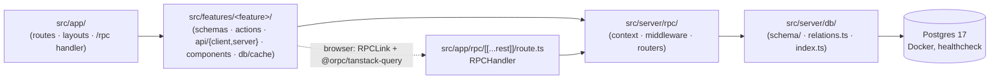
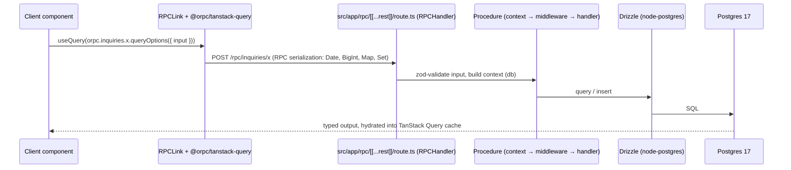

# Architecture

CoinFactory is a **single Next.js 16 (App Router) + React 19 application** that hosts its own
backend: oRPC routers and Drizzle ORM live inside the app, talking to Postgres 17 in Docker.
There is no separate backend repo, no Hono layer, no microservices — locked
architectural decisions.

> Building a feature? The step-by-step recipe is [playbooks/feature-flow.md](playbooks/feature-flow.md).

The product is one funnel: landing search → wizard (renders the **active `questions` rows
from the DB**, 6 seeded) → thank-you, persisting one `inquiries` row, its
`inquiry_answers`, and any uploaded `inquiry_files` (objects in MinIO/S3 — ADR-0005) per
submission, followed by a best-effort post-commit notification email — and, in v1 phase 2, an `/admin` surface in the same app.

## Layering & dependency direction

Strict one-way chain. Each layer reaches only rightward:



Shared leaves: `src/components/{ui,common,layout}`, `src/hooks`, `src/lib`, `src/services`,
`src/config/env` (t3-env).

`src/services/<provider>` is a first-class provider layer for shared third-party clients and
adapters: storage, email delivery, and future payment/analytics/webhook providers. Feature-owned
domain orchestration still lives inside its feature (`src/features/inquiries/email/`); pure
framework helpers stay in `src/lib/`.

## Boundary rules (load-bearing)

| Rule | Why |
|---|---|
| `src/server/**` never imports from `src/features/**` or `src/components/**` | server is the bottom of the chain; UI churn must not ripple into it |
| Features reach the server **only** via the oRPC client (browser) or the `'server-only'` router client (RSC/actions) | one contract, end-to-end types |
| Never self-fetch `/rpc` over HTTP from RSC or server actions — use `createRouterClient` | HTTP self-calls break PPR prerendering and double latency |
| Zod schemas in `features/*/schemas` are the contract shared by oRPC procedures and RHF forms | single source of validation truth |
| DB access only through `src/server/db` (globalThis-cached singleton) | Next HMR exhausts the pool otherwise |
| Server-internal app modules import `server-only`; Drizzle table files do not | `server-only` protects RSC boundaries, but `drizzle-kit` loads schema files outside Next |

## oRPC request lifecycle

Two paths, one router. Both end at the same procedures (`src/server/rpc/routers/`).

### Browser path (client components)



### Server path (RSC / server actions) — zero HTTP

```mermaid
sequenceDiagram
    participant R as RSC page / server action
    participant A as features/<f>/api/server ("use cache" + cacheTag)
    participant RC as 'server-only' createRouterClient
    participant P as Procedure
    participant D as Drizzle

    R->>A: await getX(args)
    A->>RC: client.inquiries.x(input) — direct function call, no fetch
    RC->>P: same middleware chain as HTTP path
    P->>D: query
    D-->>R: typed result, cached reads render in the PPR shell; dynamic reads stream through Suspense
```

Mutations are oRPC procedures exposed as server actions via `.actionable()` in files with
`'use server'` — never hand-rolled action functions ([ADR-0001](adr/0001-orpc-direct-no-hono.md)).

## Admin surface (v1 phase 2)

`/admin` is a route group in the **same app** — no second app, no separate deployment. Same
CF design system (dark cream-on-charcoal, data-table kit) and the **same RPC mount**: admin
procedures (question + category CRUD, inquiry list/review) live alongside the public ones in
`src/server/rpc/routers/`, behind a better-auth session middleware in
`src/server/rpc/middleware.ts`. The public surface stays exactly `inquiries.create` +
`questions.listActive` + `categories.listActive`; everything else requires an admin session.
End users never authenticate.

## Cache-tag flow (Cache Components end-to-end)

1. **Read:** `features/<feature>/api/server/*` wraps router-client calls with `"use cache"` +
   `cacheTag(...)`. Tag strings come from helpers in `features/<feature>/db/cache/` — never
   inline literals.
2. **Mutate:** the `.actionable()` procedure (or the action wrapper) calls `updateTag(...)`
   with the same helpers after a successful write.
3. **Never** `router.refresh()` for invalidation; on the browser side invalidate TanStack Query
   via `queryClient.invalidateQueries({ queryKey: orpc.x.key() })`.

## PPR / cacheComponents behavior

`cacheComponents` is on (see `next.config.mts`), so every route is partially prerendered:

- Every awaited db/oRPC call in an RSC sits inside `<Suspense>` or a `"use cache"` scope —
  otherwise the build fails or the route silently loses its static shell.
- Long-lived shared public reads (`questions.listActive`, `categories.listActive`) use
  `cacheLife("hours")`; render them directly when they belong to the initial shell, or isolate
  the smallest non-critical section under `<Suspense>` so the rest of the page does not wait.
- Never put per-user data (headers/cookies-derived) inside `"use cache"` — pass IDs as
  arguments so they become part of the cache key.
- `cacheLife` under ~5 minutes silently ejects a component from the PPR static shell.
- React 19 + Compiler are on: no hand-rolled `useMemo`/`useCallback`/`memo` unless
  profiled; new/touched components use `ref` as a normal prop instead of `forwardRef`;
  `Activity`, `useEffectEvent`, and `cacheSignal()` stay limited to the rule-gated cases.
- `typedRoutes` is on: after adding a route, run `pnpm typegen` before trusting typecheck.

## Architecture assessment (honest, current state)

Current state (2026-06-12):

- **Foundation and public persistence exist**: `src/` layout, direct oRPC mount, `health.ping`,
  globalThis-cached Drizzle client, t3-env modules, cf-themed shadcn primitives, `questions`,
  `categories`, `inquiries`, `inquiry_answers`, `inquiry_categories`, `inquiry_files`,
  `relations.ts`, migrations, and seed data are in place.
- **Public API exists**: `questions.listActive`, `categories.listActive`, and
  `inquiries.create` are wired. The submit path stores inquiry rows, answer snapshots,
  category label snapshots, supporting-file metadata, MinIO/S3 objects, and best-effort
  notification status.
- **Layered public controls are partially implemented in-app**: `/rpc` rejects oversized
  `Content-Length`, `BodyLimitPlugin` enforces the shared byte budget, oRPC middleware applies
  post-parse quotas and a per-IP throttle, and the `.actionable()` submit path carries request
  headers into the same context. Reverse-proxy/edge rate limits remain deployment work.
- **Public funnel UI exists**: `/` landing (search, categories, intake gate), `/onboarding/[step]`
  wizard (DB-driven questions, free step navigation, final-submit validation), and
  `/thank-you` confirmation — all under `(funnel)/` with ViewTransition navigation and draft
  state in layout context.
- **No auth or admin surface yet**: end users never log in; better-auth admin sessions and
  `/admin` question/category/inquiry management ship in the admin phase (slices 0007-0008).
- **Cache invalidation helpers not wired yet**: tag getters exist; `updateTag` fan-out lands with admin.
- **No tests in v1**: every slice gates on `pnpm validate` plus focused browser walkthroughs; no
  Vitest/Playwright/Storybook suite exists yet.
- **No i18n**: single-locale English.
- **GitLab remote + CI**: `origin` on GitLab; self-host deploy per ADR-0006 (manual CI deploy on runner).
