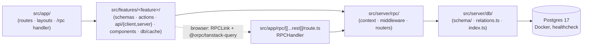
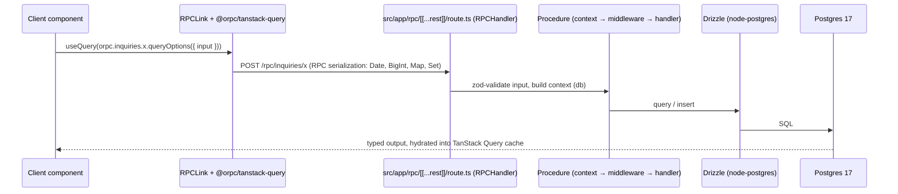
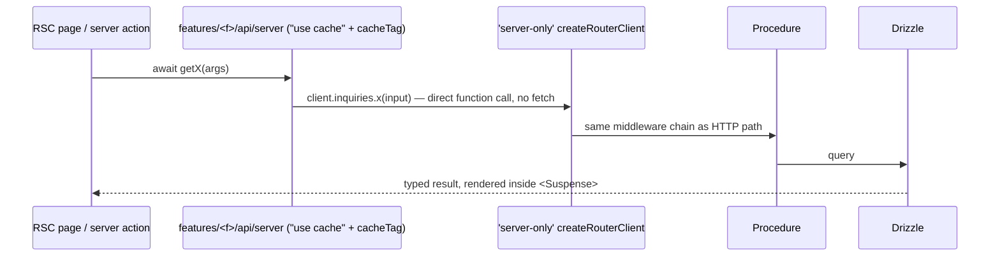

# Architecture

CoinFactory is a **single Next.js 16 (App Router) + React 19 application** that hosts its own
backend: oRPC routers and Drizzle ORM live inside the app, talking to Postgres 17 in Docker.
There is no separate backend repo, no Hono layer, no microservices — locked
architectural decisions.

> Building a feature? The step-by-step recipe is [playbooks/feature-flow.md](playbooks/feature-flow.md).

The product is one funnel: landing search → wizard (renders the **active `questions` rows
from the DB**, 6 seeded) → thank-you, persisting one `inquiries` row, its
`inquiry_answers`, and any uploaded `inquiry_files` (objects in MinIO/S3 — ADR-0005) per
submission, followed by a best-effort post-commit notification email — and, in v1 phase 2, an `/admin` surface in the same app.

## Layering & dependency direction

Strict one-way chain. Each layer reaches only rightward:

Shared leaves: `src/components/{ui,common,layout}`, `src/hooks`, `src/lib`, `src/config/env`
(t3-env).

## Boundary rules (load-bearing)

| Rule | Why |
|---|---|
| `src/server/**` never imports from `src/features/**` or `src/components/**` | server is the bottom of the chain; UI churn must not ripple into it |
| Features reach the server **only** via the oRPC client (browser) or the `'server-only'` router client (RSC/actions) | one contract, end-to-end types |
| Never self-fetch `/rpc` over HTTP from RSC or server actions — use `createRouterClient` | HTTP self-calls break PPR prerendering and double latency |
| Zod schemas in `features/*/schemas` are the contract shared by oRPC procedures and RHF forms | single source of validation truth |
| DB access only through `src/server/db` (globalThis-cached singleton) | Next HMR exhausts the pool otherwise |

## oRPC request lifecycle

Two paths, one router. Both end at the same procedures (`src/server/rpc/routers/`).

### Browser path (client components)

### Server path (RSC / server actions) — zero HTTP

Mutations are oRPC procedures exposed as server actions via `.actionable()` in files with
`'use server'` — never hand-rolled action functions ([ADR-0001](adr/0001-orpc-direct-no-hono.md)).

## Admin surface (v1 phase 2)

`/admin` is a route group in the **same app** — no second app, no separate deployment. Same
CF design system (dark cream-on-charcoal, data-table kit) and the **same RPC mount**: admin
procedures (question + category CRUD, inquiry list/review) live alongside the public ones in
`src/server/rpc/routers/`, behind a better-auth session middleware in
`src/server/rpc/middleware.ts`. The public surface stays exactly `inquiries.create` +
`questions.listActive` + `categories.listActive`; everything else requires an admin session.
End users never authenticate.

## Cache-tag flow (Cache Components end-to-end)

1. **Read:** `features/<feature>/api/server/*` wraps router-client calls with `"use cache"` +
   `cacheTag(...)`. Tag strings come from helpers in `features/<feature>/db/cache/` — never
   inline literals.
2. **Mutate:** the `.actionable()` procedure (or the action wrapper) calls `updateTag(...)`
   with the same helpers after a successful write.
3. **Never** `router.refresh()` for invalidation; on the browser side invalidate TanStack Query
   via `queryClient.invalidateQueries({ queryKey: orpc.x.key() })`.

## PPR / cacheComponents behavior

`cacheComponents` is on (see `next.config.mts`), so every route is partially prerendered:

- Every awaited db/oRPC call in an RSC sits inside `<Suspense>` or a `"use cache"` scope —
  otherwise the build fails or the route silently loses its static shell.
- Never put per-user data (headers/cookies-derived) inside `"use cache"` — pass IDs as
  arguments so they become part of the cache key.
- `cacheLife` under ~5 minutes silently ejects a component from the PPR static shell.
- React Compiler is on: no hand-rolled `useMemo`/`useCallback`/`memo` unless profiled.
- `typedRoutes` is on: after adding a route, run `pnpm typegen` before trusting typecheck.

## Architecture assessment (honest, current state)

Greenfield with the foundation delivered (2026-06-10): the `src/` layout, the oRPC mount
with a working `health.ping` router, the globalThis-cached db client (empty schema barrel),
t3-env modules, and 14 cf-themed shadcn primitives all exist. What does NOT exist today:

- **No funnel/wizard UI and no domain schema** — the `questions`/`inquiries`/`inquiry_answers`/
  `inquiry_files` tables, `relations.ts`, feature routers, and every screen ship in later
  vertical slices.
- **No auth yet** — the funnel is public forever (end users never log in); better-auth admin
  sessions arrive with the admin phase (slices 0007–0008). The `authedProcedure` middleware slot
  in `src/server/rpc/middleware.ts` is for that phase.
- **No admin surface yet** — `/admin` (question CRUD, inquiry list/review) ships as v1
  phase 2, slices 0007–0008.
- **No tests in v1** — every slice gates on `pnpm validate` only; no Vitest/Playwright/
  Storybook.
- **No i18n** — single-locale English.
- **No abuse controls yet** on the public inquiry endpoint — the layered v1 controls
  (pre-parse body cap + per-IP rate limit at the proxy/route handler,
  `serverActions.bodySizeLimit`, oRPC post-parse quotas, honeypot) ship with the funnel
  slices per ADR-0005; see [SECURITY.md](SECURITY.md).
- **No git remote / CI** — local repo only; commands that mention `gh` note this.

What is already solid: the source layout, the direct oRPC integration, the validated env/db
foundation, the cf design tokens, and the `pnpm validate` gate.
